<div align="center">

# 개 잘키우개

**반려견 행동 고민을 물어보면, 전문 자료를 찾아 한국어로 답해주는 RAG 챗봇**

[](https://gtukim.duckdns.org/dogbreeder/)

[주요 기능](#주요-기능) · [기술 스택](#기술-스택) · [트러블슈팅](#트러블슈팅) · [배운 점](#배운-점)

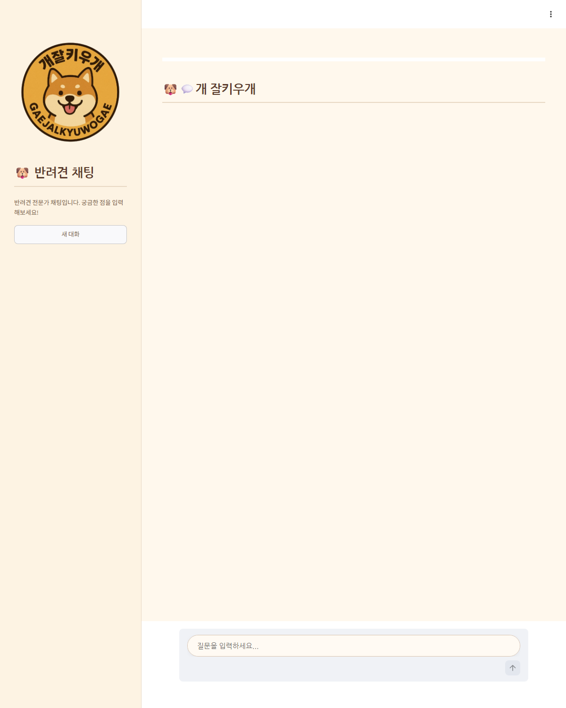

</div>

<br>

## 프로젝트 소개

반려견을 키우다 보면 "얘가 왜 이러지?" 싶은 순간이 정말 많습니다.
**개 잘키우개**는 그런 행동 고민을 물어보면, 미리 모아둔 전문 자료에서 관련 내용을 찾아 한국어로 답해주는 챗봇입니다.
지금 바로 [배포된 사이트](https://gtukim.duckdns.org/dogbreeder/)에서 써볼 수 있습니다.

<br>

## 팀원 소개

<div align="center">

| [김상익](https://github.com/GTU9) | [김장수](https://github.com/js-kkk) | [김한솔](https://github.com/kim-hansol314) | [전유빈](https://github.com/yubnyx) |
|--------|--------|--------|-------|
|  |  |  |  |

</div>

**개발 기간** : 2025.04.30 ~ 2025.05.15 (16일)

<br>

## 기획 배경

요즘은 네 집 중 한 집이 반려동물을 키운다고 할 만큼 반려동물이 많아졌습니다.
그런데 키우는 가구가 늘어난 만큼, 행동 문제로 힘들어하거나 파양까지 고민하는 경우도 함께 늘었습니다.

<div align="center">
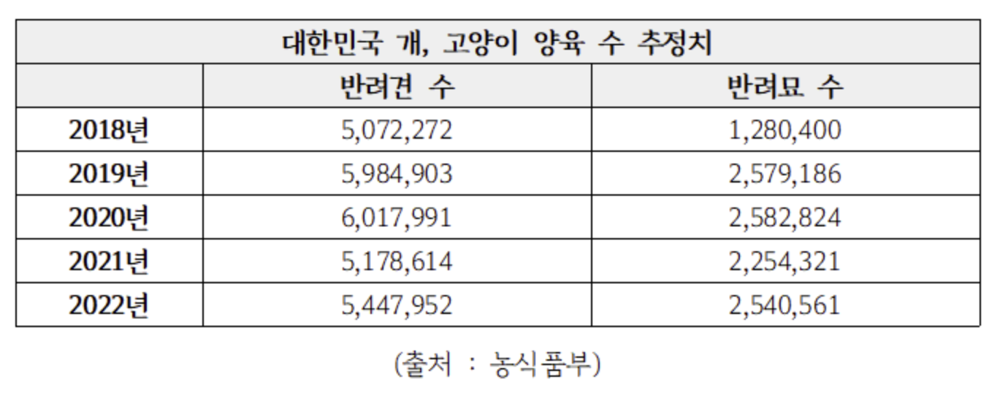
<p>2022년 기준 약 602만 가구(전체 25.4%)가 반려동물을 키우는데, 이는 10년 전보다 65% 이상 늘어난 수치입니다.</p>
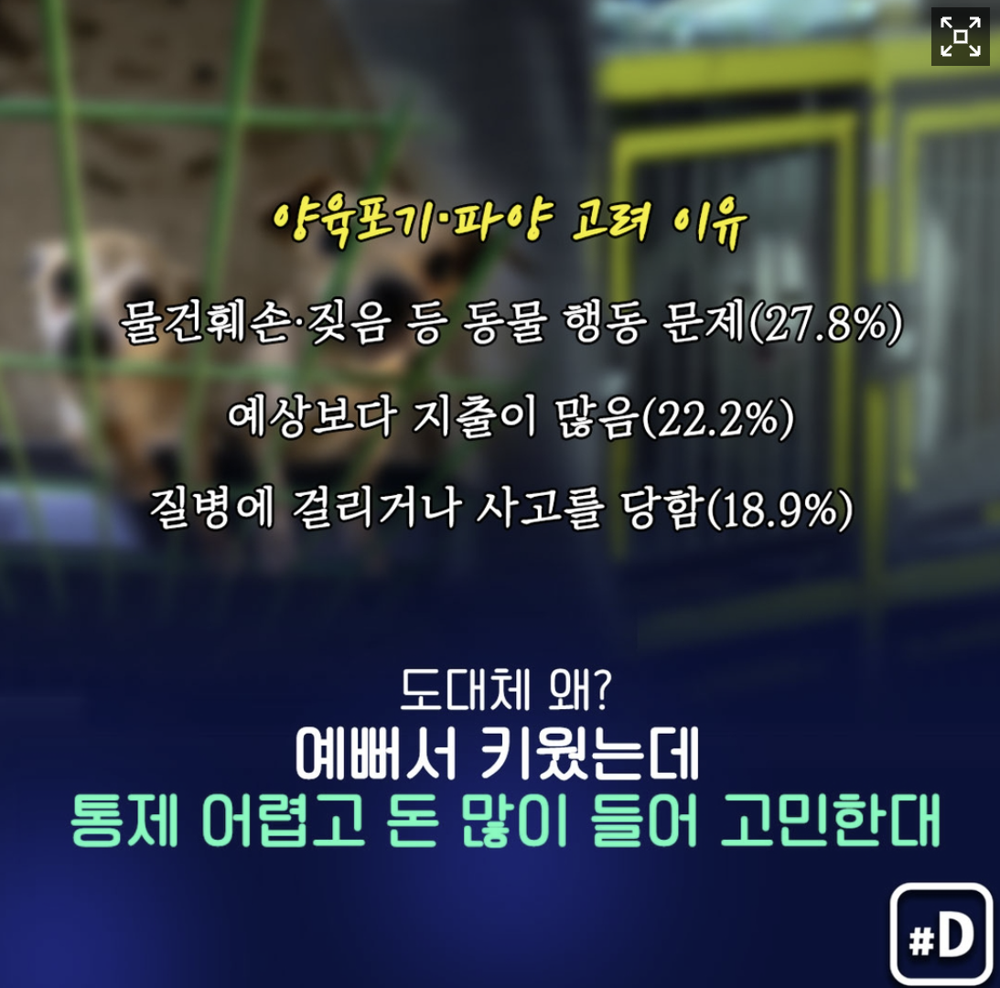
<p>양육자 4명 중 1명은 파양을 고려한 적이 있다고 답했습니다.</p>
</div>

문제 행동의 원인을 잘 모르면 보호자도 지치고, 결국 반려동물에게도 안 좋습니다.
그래서 "행동 고민이 생겼을 때 가볍게 물어볼 수 있는 챗봇이 있으면 좋겠다"는 생각으로 이 프로젝트를 시작했습니다.

> 참고 기사 — [인간과 개의 소통, 외부 요인에 영향 많이 받아](https://www.newstomato.com/ReadNews.aspx?no=1255878) · [양육자 4명 중 1명 "파양 고려했다"](https://www.yna.co.kr/view/AKR20220107047400797)

<br>

## 주요 기능

직접 배포한 사이트에서 찍은 화면으로 소개합니다.

### 1. 자료 기반 답변 & 출처 링크

견종 특성이나 행동에 대해 물어보면, 미리 모아둔 문서에서 관련 내용을 찾아 답합니다.
답변 아래에는 **어떤 자료를 참고했는지 출처 링크**도 같이 보여줘서, 더 자세히 알고 싶으면 눌러볼 수 있습니다.

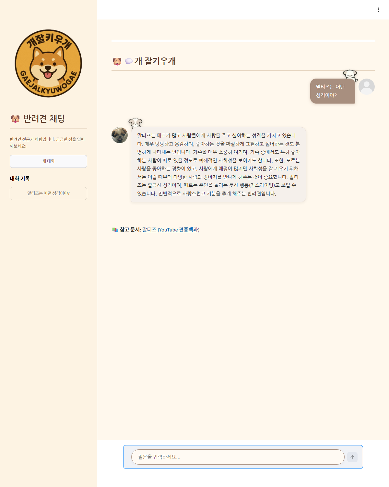

### 2. 대화 맥락 기억

"강아지가 자꾸 짖어요" 라고 물어본 뒤에 "그럼 어떻게 훈련시켜야 해?" 라고만 해도,
앞에서 말한 짖음 문제를 기억하고 그에 맞는 훈련 방법을 알려줍니다.

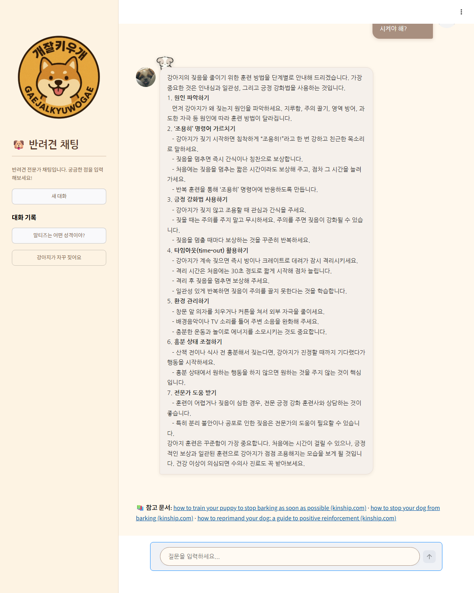

### 3. 건강 안전 안내

구토, 초콜릿 섭취처럼 건강·응급이 의심되는 질문에는,
행동 조언만 하지 않고 **"수의사와 상담하세요"** 라는 안내를 꼭 같이 붙입니다.

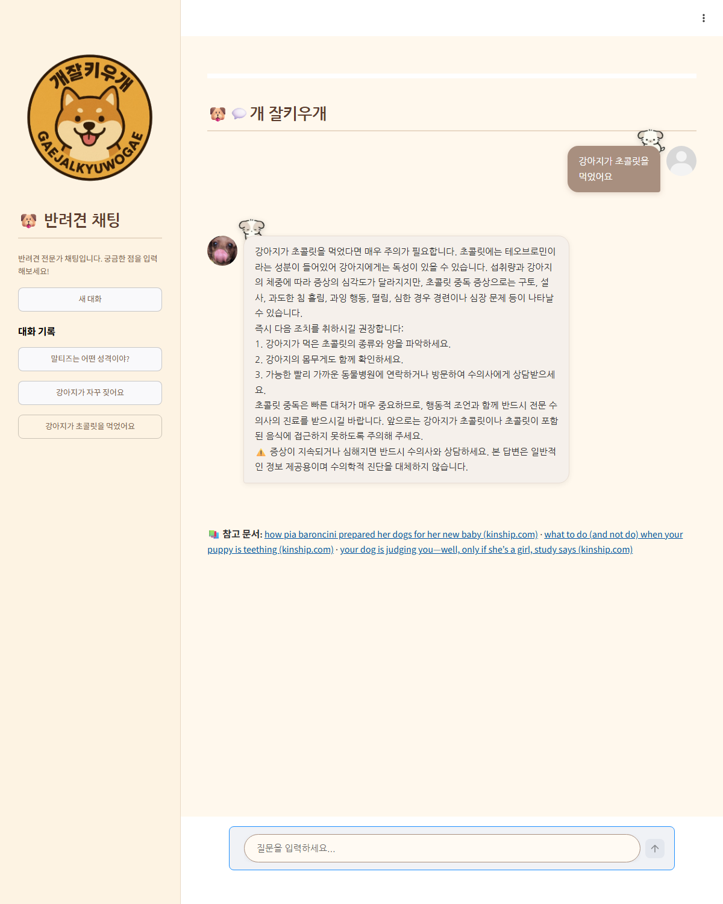

### 4. 범위 외 질문 가드 & 대화 기록

"고양이가 밥을 안 먹어요" 처럼 강아지가 아닌 질문이 들어오면, 아는 척 답하지 않고
**"저는 반려견 상담 전문 챗봇이에요"** 라고 솔직하게 안내합니다.
왼쪽 사이드바에는 **이전 대화 기록**이 남아 다시 볼 수 있습니다.

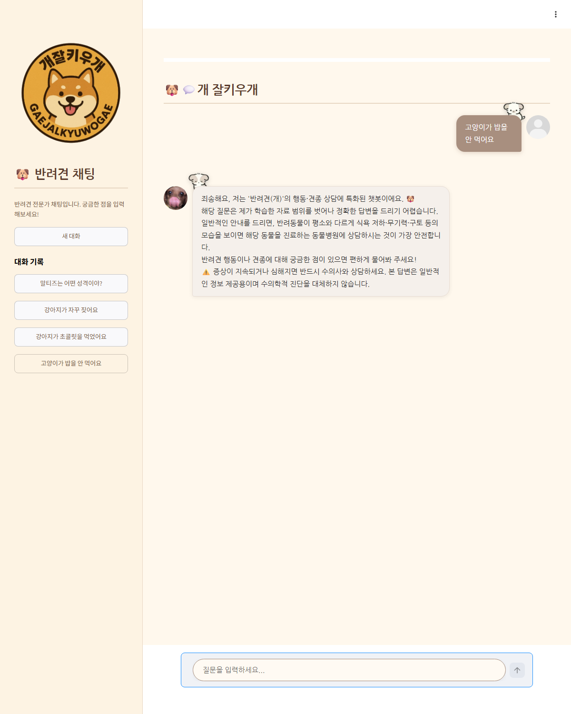

<br>

## 기술 스택

**언어 · 프레임워크**


**AI · 검색**


**데이터 수집**


**배포 · 협업**


<br>

## 시스템 아키텍처

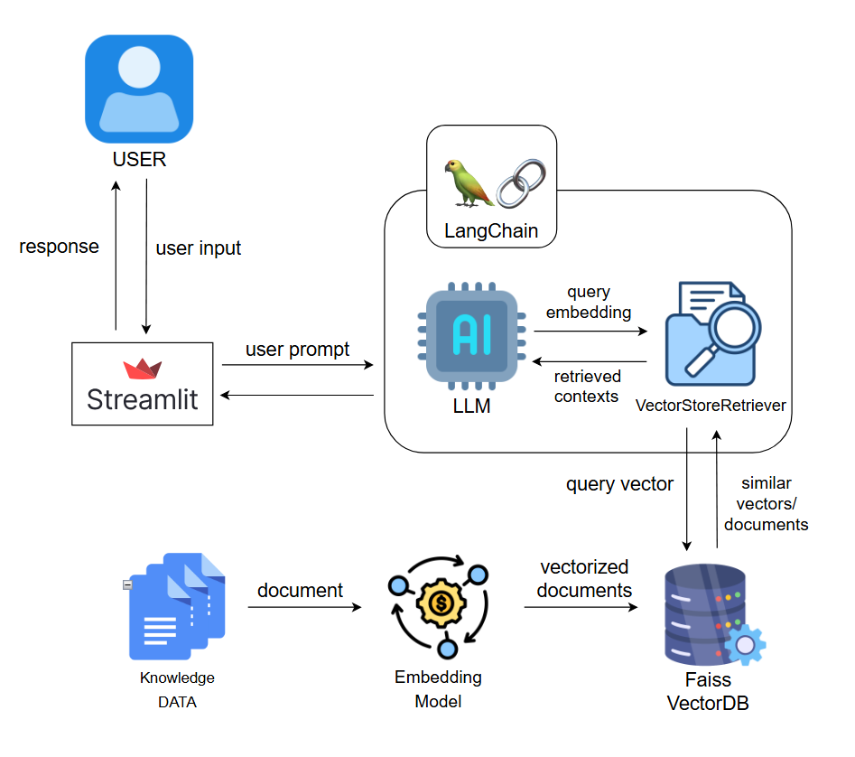

<br>

## 프로젝트 구조

```
DogbreederDog/
├─ app.py                # Streamlit 챗봇 메인 (UI + 대화 흐름)
├─ py_file/
│  ├─ QA_bot.py          # RAG 핵심 — FAISS 검색 + 답변 생성
│  ├─ crawling/          # kinship.com 크롤링
│  ├─ preparing_data/    # 유튜브 음성 전사 · 데이터 정제
│  └─ use_vectordb/      # FAISS 벡터 DB 생성
├─ llm/call_llm.py       # OpenAI 호출 유틸
├─ data/db/faissdb/      # 완성된 FAISS 벡터 DB
├─ requirements.txt
├─ Dockerfile            # docker-compose.yml 로 배포
└─ README.md
```

<br>

## 요구사항 명세서

목표한 기능을 정리하고 하나씩 완성해 나갔습니다.

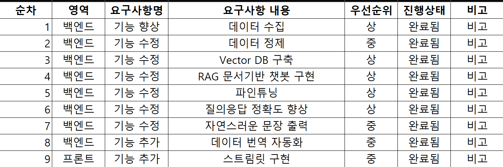

**WBS**

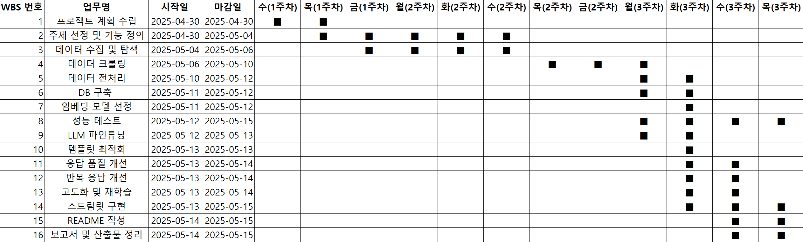

<br>

## 데이터 수집 & 전처리

답변의 근거가 될 반려견 자료를 두 곳에서 모았습니다.

**1. 강형욱의 보듬 TV - 견종백과 (유튜브)**
- Whisper로 영상 음성을 텍스트로 변환
- LLM으로 견종명을 정리하고 필요 없는 부분을 다듬음
- LangChain 문서(JSON) 형식으로 저장

**2. [kinship.com](https://www.kinship.com/dog) (반려견 정보 사이트)**
- Selenium으로 동적 페이지를 열고, BeautifulSoup으로 본문을 파싱
- 총 799개 문서를 수집

이렇게 모은 문서를 FAISS 벡터 DB로 만들어서, 질문이 들어오면 비슷한 문서를 빠르게 찾도록 했습니다.

<br>

## 트러블슈팅

처음부터 잘 됐던 건 아니고, 막히는 부분이 몇 군데 있었습니다.

### 한글 질문 ↔ 영어 문서 문제

저희 데이터는 **견종 정보는 한글, 행동 정보는 영어** 라서 섞여 있었습니다.
처음 쓴 임베딩 모델로는 한글로 물어보면 영어 문서를 거의 못 찾아서 답변 품질이 떨어졌습니다.

<div align="center">
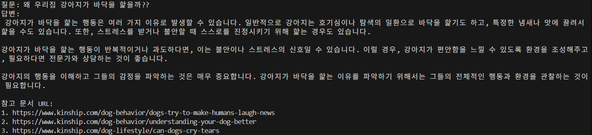
<p>처음 모델로는 관련 문서를 제대로 못 찾던 모습</p>
</div>

여러 임베딩 모델의 성능과 속도를 직접 비교해서, 다국어를 잘 지원하는 **bge-m3** 모델을 골랐습니다.

<div align="center">
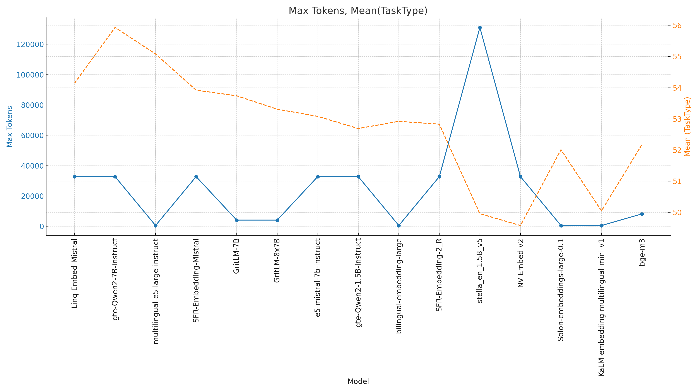
<p>임베딩 모델별 성능 비교</p>
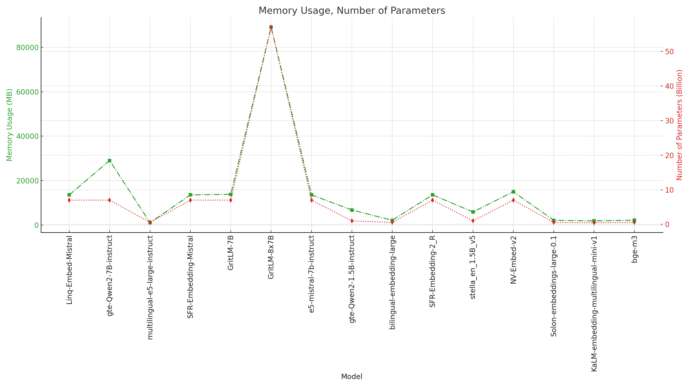
<p>임베딩 모델별 속도 비교</p>
</div>

모델을 바꾸니 한글·영어 문서를 훨씬 잘 찾아줬습니다.
그래도 가끔 영어 문서가 검색되면, 질문을 영어로 한 번 더 바꿔 검색하는 보완 장치를 넣었습니다.

<div align="center">
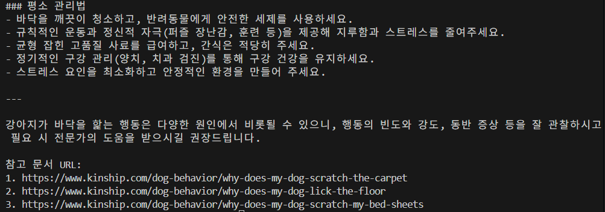
<p>한영 변환 함수 추가 전 — 관련 문서를 잘 못 찾던 모습</p>
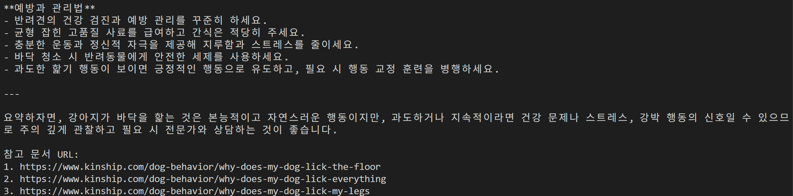
<p>함수 추가 후 — 관련 문서를 찾아 답하는 모습</p>
</div>

### 파인튜닝 시도

GPT-4.1-mini를 일부 데이터로 파인튜닝해서, 우리가 모은 문서 내용을 더 잘 반영하도록 시도해봤습니다.

<div align="center">
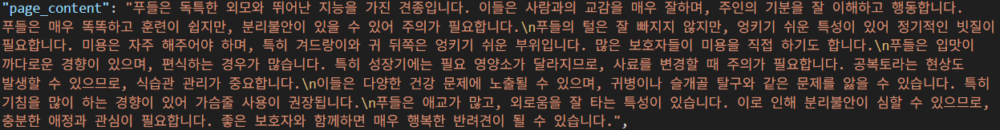
<p>학습에 쓴 원본 데이터</p>
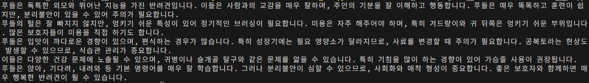
<p>파인튜닝 후 답변 — 학습한 내용을 반영해 답합니다</p>
</div>

학습시킨 문서를 기반으로 답하는 건 확인했지만, 시간과 비용 문제로 전체에 적용하지는 못한 점이 아쉬웠습니다.

<br>

## 수행 결과

<div align="center">
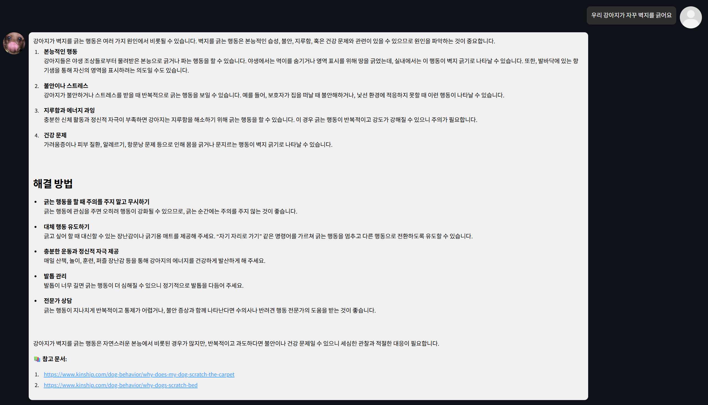
<p>"우리 강아지가 자꾸 벽지를 긁어요" 질문에 원인과 해결 방법을 답하는 모습</p>
</div>

<br>

## 배운 점

| 영역 | 배운 점 |
|------|---------|
| RAG | 검색 품질이 답변 품질을 좌우한다는 걸 체감했고, 임베딩 모델 선택이 중요하다는 걸 알게 됐습니다. |
| 데이터 | 한글·영어가 섞인 데이터에서 생기는 검색 문제와, 그걸 해결하는 과정을 직접 겪어봤습니다. |
| 모델 | 파인튜닝을 직접 해보며 비용 대비 효과를 따져보는 감각을 익혔습니다. |
| 배포 | Docker로 실제 서비스까지 띄워보며 전체 흐름을 경험했습니다. |

<br>

## 회고

**김상익** — RAG 기반 챗봇을 직접 만들어보면서 실제로 쓸 만한 응답 품질을 얻을 수 있었습니다. 다양한 LLM을 파인튜닝해 성능을 더 끌어올리려 했는데, 제한된 시간 안에서 기대만큼 나오지 않은 점은 아쉬웠습니다. 그래도 여러 모델을 직접 비교하고 적용해본 경험이 모델 선택에 대한 이해를 크게 넓혀줬습니다.

**김장수** — 한글·영어 데이터를 같이 쓰면서 생긴 유사도 문제 덕분에 RAG를 제대로 이해하게 됐습니다. 데이터에 맞는 임베딩 모델을 고민하고, 최신 GPT-4.1 모델로 파인튜닝까지 해본 게 재밌는 경험이었습니다.

**김한솔** — 단순히 챗봇을 만드는 걸 넘어서, 방대한 자료를 구조화하고 정제하는 과정에서 많은 걸 배웠습니다.

**전유빈** — 가장 적합한 모델을 찾는 일의 중요성을 느꼈고, 파인튜닝을 이해하는 데 큰 도움이 됐습니다. 파일 정리를 체계적으로 해야겠다는 생각도 했습니다.
